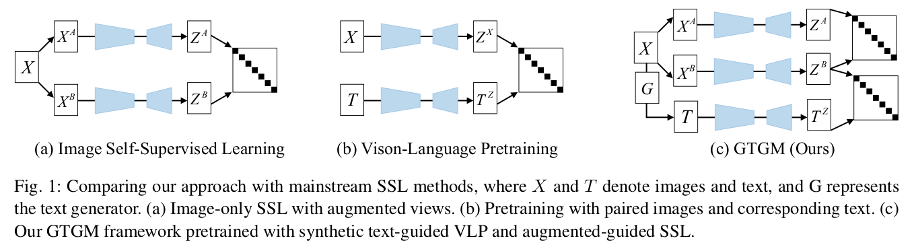
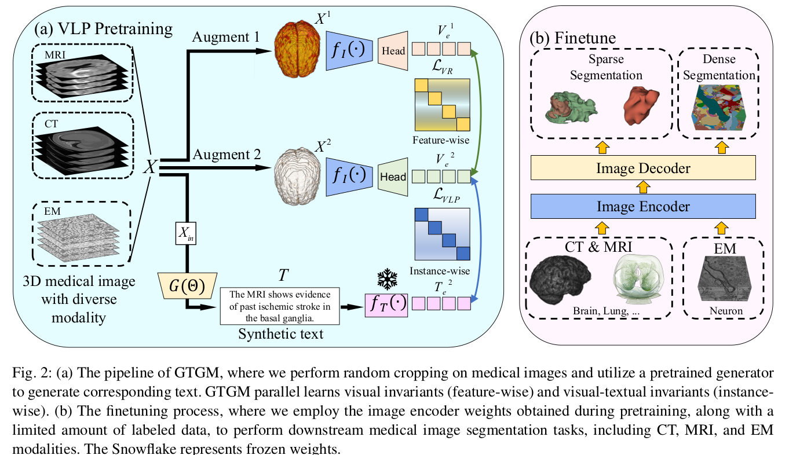

# GTGM+ : Knowledge-Enhanced 3D Vision-Language Pretraining for Multi-Modal Medical Image Analysis

[](https://arxiv.org/pdf/2306.04811)
[](LICENSE)

This repository contains the official implementation of the paper **[GTGM+: Knowledge-Enhanced 3D Vision-Language Pretraining for Multi-Modal Medical Image Analysis](https://arxiv.org/pdf/2306.04811)**, published in *Computer Vision and Image Understanding (CVIU)*.

<div style="text-align: center;">
  
</div>

<div style="text-align: center;">
  
</div>

## 🔑 Key Contributions

1. **Medical Knowledge Graph-Enhanced Text Refinement**: A three-stage pipeline (entity extraction → relationship validation → clinical synthesis) with image-guided entity disambiguation that transforms generic LLM outputs into clinically accurate descriptions grounded in UMLS and SNOMED-CT ontologies.

2. **Hierarchical Cross-Modal Attention**: 3D shifted window attention mechanism operating at three spatial scales (organ 16³, tissue 32³, cellular 64³) for fine-grained anatomical-textual correspondence with O(N·w³) complexity.

3. **Multi-Granularity Contrastive Learning**: Combined fine-grained patch-level and global semantic alignment losses for robust cross-modal representation learning.

4. **Comprehensive Evaluation**: Consistent improvements across **13 datasets** spanning CT, MRI, and EM modalities — 3.2% average Dice improvement on CT, 2.8% on MRI, and 15.3% VOI reduction on EM segmentation.

## 📁 Repository Structure

```
gtgm/
├── config/                          # Configuration files
│   ├── pretraining_all.yaml         # Joint pretraining (CT+MRI+EM)
│   ├── pretraining_cremic.yaml      # EM-only pretraining
│   ├── pretraining_snemi3d.yaml     # SNEMI3D pretraining
│   ├── seg_3d.yaml                  # Segmentation config
│   └── seg_snemi3d_*.yaml           # SNEMI3D segmentation configs
│
├── pretrain/                        # Pretraining code
│   ├── main.py                      # Entry point for distributed pretraining
│   ├── config.yaml                  # VLP-specific config
│   ├── dataloader/                  # Data loading modules
│   │   ├── data_provider_pretraining.py    # Main pretraining dataset
│   │   ├── data_provider_labeled.py        # Labeled data provider
│   │   └── provider_valid*.py              # Validation providers
│   └── utils/                       # Utility modules
│       ├── utils_builder.py         # Model architecture (ResNet_CXRBert)
│       ├── utils_trainer.py         # Training loop & losses
│       ├── utils_resnet3d.py        # 3D ResNet backbone
│       ├── swin_unetr.py           # SwinUNETR encoder
│       └── augmentation*.py        # Data augmentation
│
├── finetune/                        # Downstream fine-tuning
│   ├── train.py                     # MSD segmentation fine-tuning
│   ├── resunet.py                   # 3D ResUNet decoder
│   ├── attresUnet.py                # ResUNet + Self-Attention
│   ├── swin_unetr.py               # SwinUNETR for fine-tuning
│   ├── task*.py                     # Task-specific configs
│   └── MSD_inference.py             # Inference script
│
├── NeuronSeg/                       # EM neuron segmentation
│   ├── main.py                      # EM training entry point
│   ├── inference.py                 # EM inference
│   ├── model/                       # Segmentation models
│   ├── data/                        # EM data loading
│   ├── loss/                        # Loss functions
│   └── utils/                       # EM utilities
│
├── data/                            # Shared data utilities
│   ├── pretrainDataset.py           # Pretraining dataset class
│   ├── data_provider.py             # General data provider
│   ├── data_segmentation.py         # Segmentation data
│   └── data_transform.py           # Data transforms
│
├── main.png                         # Framework diagram
├── teasor.png                       # Teaser figure
└── README.md                        # This file
```

## 🚀 Quick Start

### Environment Setup

We provide a Docker image with all dependencies pre-installed:

```bash
sudo docker pull registry.cn-hangzhou.aliyuncs.com/mybitahub/large_model:mamba0224_ydchen
```

Alternatively, install dependencies manually:

```bash
pip install torch torchvision transformers monai nibabel h5py tensorboardX \
            scikit-image waterz attrdict pyyaml tqdm pillow
```

### Step 1: Pretraining

Run distributed pretraining across multiple GPUs:

```bash
# Joint pretraining on CT + MRI + EM (recommended)
torchrun --nnodes=1 --nproc_per_node=8 pretrain/main.py \
    --config config/pretraining_all.yaml \
    --seed 42

# Single GPU pretraining
torchrun --nnodes=1 --nproc_per_node=1 pretrain/main.py \
    --config config/pretraining_all.yaml
```

**Key configurations** (edit `config/pretraining_all.yaml`):
| Parameter | Default | Description |
|-----------|---------|-------------|
| `DATA.type` | `all` | Modality: `CT`, `MRI`, `EM`, or `all` |
| `trainer.max_iterations` | 200000 | Total training iterations |
| `trainer.batch_size` | 2 | Per-GPU batch size |
| `trainer.lr` | 2e-5 | Learning rate |
| `optimizer.params.weight_decay` | 5e-2 | Weight decay |

### Step 2: Downstream Fine-tuning

Fine-tune the pretrained encoder on MSD segmentation tasks:

```bash
# Fine-tune on Heart MRI segmentation
python finetune/train.py \
    --task_name Task02_Heart \
    --model_name ResUNet \
    --pretrained \
    --pretrained_path checkpoints/gtgm_plus_final_encoder.pth \
    --data_dir /path/to/MSD/ \
    --batch_size 8 \
    --max_iterations 25000

# Fine-tune with 1% labels (data efficiency experiment)
python finetune/train.py \
    --task_name Task03_Liver \
    --model_name ResUNet \
    --pretrained \
    --pretrained_path checkpoints/gtgm_plus_final_encoder.pth \
    --label_ratio 0.01

# Fine-tune with self-attention model
python finetune/train.py \
    --task_name Task03_Liver \
    --model_name ResUNetWithAttention \
    --pretrained \
    --pretrained_path checkpoints/gtgm_plus_final_encoder.pth
```

**Supported MSD Tasks:**
| Task | Modality | Classes | Description |
|------|----------|---------|-------------|
| `Task01_BrainTumour` | MRI | 4 | Brain tumor segmentation |
| `Task02_Heart` | MRI | 2 | Cardiac segmentation |
| `Task03_Liver` | CT | 3 | Liver & tumor segmentation |
| `Task04_Hippocampus` | MRI | 3 | Hippocampus segmentation |
| `Task05_Prostate` | MRI | 3 | Prostate segmentation |
| `Task06_Lung` | CT | 2 | Lung tumor segmentation |
| `Task07_Pancreas` | CT | 3 | Pancreas & tumor segmentation |
| `Task08_HepaticVessel` | CT | 3 | Hepatic vessel segmentation |
| `Task09_Spleen` | CT | 2 | Spleen segmentation |
| `Task10_Colon` | CT | 2 | Colon cancer segmentation |

### Step 3: EM Neuron Segmentation

```bash
cd NeuronSeg
python main.py -c seg_snemi3d_d5_1024_u200 -m train
```

## 📊 Main Results

### CT Segmentation (Dice %)

| Method | Liver (1%/10%/100%) | Pancreas (1%/10%/100%) | Lung (1%/10%/100%) |
|--------|---------------------|------------------------|---------------------|
| Random Init | 45.21/51.24/61.34 | 37.07/56.21/63.96 | 41.67/57.36/73.49 |
| BYOL | 45.11/52.33/61.67 | 39.83/56.82/64.51 | 43.19/59.84/76.41 |
| PCRLv2 | 51.69/56.63/65.19 | 39.80/56.05/63.38 | 43.89/55.30/74.19 |
| GTGM | 52.46/58.67/65.61 | 40.55/59.96/65.61 | 46.45/61.30/80.19 |
| **GTGM+ (Ours)** | **53.51/59.83/66.81** | **41.87/61.13/66.74** | **47.23/62.57/81.49** |

### MRI Segmentation (Dice %)

| Method | BrainTumour | Heart | Hippocampus | Prostate |
|--------|-------------|-------|-------------|----------|
| GTGM | 33.19/34.12/45.23 | 72.83/86.33/94.71 | 53.41/79.01/84.92 | 34.84/40.93/44.24 |
| **GTGM+ (Ours)** | **34.05/35.46/46.72** | **73.91/87.53/95.23** | **54.72/80.17/86.13** | **35.67/41.95/45.91** |

### EM Neuron Segmentation (VOI ↓)

| Method | CREMI A (10%/75%) | CREMI B (10%/75%) | CREMI C (10%/75%) |
|--------|-------------------|-------------------|-------------------|
| GTGM | 0.882/0.709 | 1.474/1.247 | 1.378/1.245 |
| **GTGM+ (Ours)** | **0.865/0.692** | **1.451/1.224** | **1.351/1.218** |

## 📋 To-Do List
- [x] Open-sourced the core code
- [x] Wrote the README for code usage
- [ ] Open-sourced the pre-training dataset
- [ ] Upload the pre-trained weights

## 📝 Citation

If you find this code or dataset useful in your research, please consider citing our paper:

```bibtex
@article{chen2025gtgmplus,
  title={GTGM+: Knowledge-Enhanced 3D Vision-Language Pretraining for Multi-Modal Medical Image Analysis},
  author={Chen, Yinda and Shi, Haoyuan and Xiong, Zhiwei},
  journal={Computer Vision and Image Understanding},
  year={2025}
}

@article{chen2023generative,
  title={Generative text-guided 3d vision-language pretraining for unified medical image segmentation},
  author={Chen, Yinda and Liu, Che and Huang, Wei and Cheng, Sibo and Arcucci, Rossella and Xiong, Zhiwei},
  journal={arXiv preprint arXiv:2306.04811},
  year={2023}
}
```

## 📧 Contact

For questions or collaborations, please contact:
- **Yinda Chen**: [yindachen@mail.ustc.edu.cn](mailto:yindachen@mail.ustc.edu.cn)
- **Zhiwei Xiong** (Corresponding author): [zwxiong@ustc.edu.cn](mailto:zwxiong@ustc.edu.cn)

## License

This project is licensed under the MIT License - see the [LICENSE](LICENSE) file for details.
